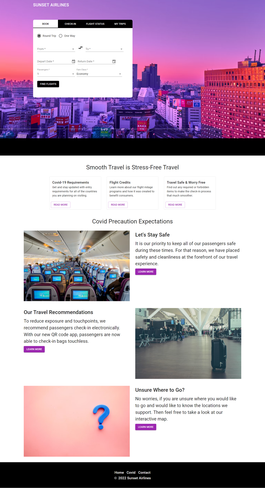

# Sunset Airlines Frontend

Sunset Airlines is an eHub for individuals to purchase airplane tickets. This project is only intended to be practice, and not to represent a legitimate entity.

Sunset Airlines frontend is built in React using TypeScript. The frontend incorporates Redux Toolkit, react-hook-form, Material UI, and Stripe.

All implementations are still in in work, but a demo of what is available is below.

